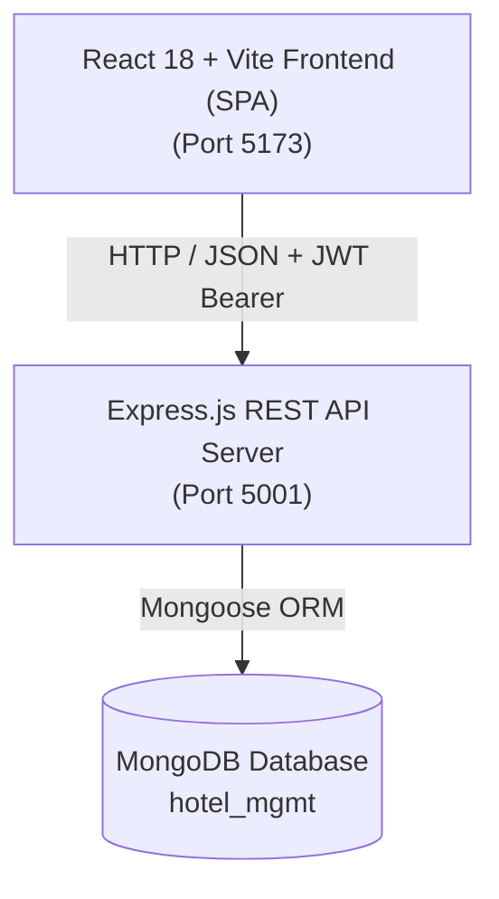

# PARADISE Palace Hotels Platform — Architecture & Context

## 1. System Architecture Overview

The **PARADISE Palace Hotels Platform** is a full-stack hotel management and reservation web application built with a modern decoupled client-server architecture:



### Key Technologies:
- **Frontend**: React 18, Vite, TypeScript, TailwindCSS, Lucide React, React Router v6.
- **State Management**: React `AuthContext` with persistent `localStorage` JWT session recovery and reactive role-based navigation.
- **Backend API**: Node.js, Express.js (ES Modules), JWT (JSON Web Tokens), `bcryptjs` password hashing.
- **Database**: MongoDB (via Mongoose ODM) with schemas for Users, Hotels, Rooms, Bookings, and Coupons.

---

## 2. Role-Based Access Control (RBAC) Matrix & Dashboard Architecture

The system enforces 4 hierarchical tiers with distinct access permissions and dedicated dashboard interfaces:

| Role | Intended Persona | Access Area | Core Capabilities & Dedicated Workflow |
|---|---|---|---|
| **Front Desk Staff** (`staff`) | Front Desk & Concierge | `/admin` (Front Desk Terminal) | **Live Tactical Operations**: Real-time Room Board (Rooms 101–304) with Housekeeping Clean/Dirty toggles, 1-Click Guest Check-In & Check-Out, Room Key Assignment, and Guest Concierge Request Logging. |
| **Hotel Manager** (`hotel_manager`) | Property Operations Manager | `/admin` (Manager Portal) | **Strategic & Financial Operations**: Property Occupancy Rate % gauge, Total Property Revenue, Average Daily Rate (ADR), Dynamic Surge/Discount Nightly Rate Adjuster (+₹500 / -₹500), Physical Room Inventory Unit controls, and Guest Ledger. |
| **Super Admin** (`super_admin`) | Platform Owner / Enterprise Admin | `/admin` (Command Center) | **Multi-Property Platform Oversight**: Multi-hotel portfolio management (6 Luxury Properties), Global Reservations Master Ledger, Promo Discount Engine, and RBAC Team Provisioning (Manager & Staff accounts). |
| **Customer** (`customer`) | Guest / Public Visitor | `/`, `/hotels`, `/bookings` | **Self-Service Booking Portal**: Browse curated luxury properties across India, check real-time availability, apply promo discount codes, reserve suites, and view booked stay itineraries. |

> **Security Rule**: Public signups (`/login` -> "Create Customer Account") are restricted to the `customer` role. Management roles (`hotel_manager`, `staff`, `super_admin`) can only be provisioned internally by a Super Admin inside `/admin` under the **Team & Staff** tab with property bindings.

---

## 3. Dedicated Dashboard Specifications

### 🛎️ A. Front Desk & Concierge Operations Desk (`role === 'staff'`)
- **Live Shift Counters**: Real-time KPI cards for *Today's Arrivals*, *Currently In-House Guests*, *Departures Today*, and *Clean Rooms Ready*.
- **Live Room Status Grid (101–304)**: Visual room cards displaying live occupancy, current guest name, departure date, and 1-click Housekeeping Status toggles (`Clean` 🟢, `Dirty` 🟡, `Cleaning` 🔵).
- **Operational Guest Queue**: Instant filterable queue (`All`, `Arrivals`, `In-House`, `Departures`) with fast search across name, phone, email, and room number.
- **Room Key Assignment & Concierge Notes**: Assign physical room keys (e.g. Room 204) and record special guest requests (e.g. *Late check-in 11 PM*, *Airport shuttle requested*, *Extra feather pillows*).
- **1-Click Express Check-In & Check-Out**: Seamlessly transitions reservations between `confirmed` $\rightarrow$ `checked_in` $\rightarrow$ `checked_out`.

### 📊 B. Hotel Operations Manager Portal (`role === 'hotel_manager'`)
- **Hospitality Executive KPIs**:
  - **Occupancy Rate %**: Dynamic calculation of occupied vs total physical units with visual progress bar.
  - **Total Property Revenue**: Aggregate earnings from confirmed and checked-in reservations for the assigned property.
  - **Average Daily Rate (ADR)**: Average revenue earned per occupied room night.
  - **Verified Guest Rating**: Aggregated star rating (4.9 / 5.0).
- **Dynamic Suite Pricing & Inventory Controller**:
  - Live nightly rate adjuster with quick surge buttons (`+500`, `-500`) and inline saving directly to `/api/hotels/rooms/:id`.
  - Physical room inventory unit capacity management.
  - Suite provisioning modal bound to the manager's property.
- **Property Guest Ledger**: Complete searchable reservation history for the manager's hotel.

### 👑 C. Super Admin Command Center (`role === 'super_admin'`)
- **Global Platform Analytics**: Total multi-hotel revenue, aggregate bookings count, active hotels, and live promotional campaigns.
- **Hotels Portfolio**: Full management of the 6 luxury destinations across India (Delhi, Goa, Jaipur, Mumbai, Udaipur, Manali) with "Add New Hotel Property" modal.
- **Promotional Coupon Engine**: Create, toggle, and manage discount percentage codes with expiry dates.
- **RBAC Team Provisioning**: Securely create Hotel Manager and Front Desk accounts with hotel assignment.

---

## 4. Project Directory Structure

```
Hotel-Mgmt/
├── apps/
│   └── booking/                   # Client Single Page Application (SPA)
│       ├── src/
│       │   ├── components/        # Reusable UI components (Buttons, Inputs, Modals)
│       │   │   ├── auth/          # Password strength indicators & validators
│       │   │   ├── layout/        # Navbar with reactive role states & Footer
│       │   │   └── ui/            # Curated Person AvatarPicker, DateRangePicker, Buttons
│       │   ├── hooks/             # useAuth hook & AuthContext provider
│       │   ├── lib/               # api.ts (Axios wrapper with JWT interceptor)
│       │   ├── pages/             # Route pages
│       │   │   ├── admin/         # AdminDashboardPage.tsx (Role-specialized Front Desk, Manager & Admin)
│       │   │   ├── LandingPage.tsx
│       │   │   ├── HotelListingPage.tsx
│       │   │   ├── HotelDetailsPage.tsx
│       │   │   ├── BookingsPage.tsx
│       │   │   ├── LoginPage.tsx  # Horizontal Role Selection & Two-Step Auth
│       │   │   └── ProfilePage.tsx
│       │   └── App.tsx            # Route definitions and AuthProvider wrapper
├── server/                        # Express.js REST API Server
│   ├── config/
│   │   └── db.js                  # Mongoose MongoDB connection initializer
│   ├── middleware/
│   │   └── auth.js                # JWT token verifier & authorizeRoles middleware
│   ├── models/                    # Mongoose Schemas (User, Hotel, Room, Booking, Coupon)
│   ├── routes/                    # Express Router Endpoints
│   │   ├── authRoutes.js          # /api/auth (Login, Register, Profile, Admin User Mgmt)
│   │   ├── hotelRoutes.js         # /api/hotels (Properties, Rooms, Dynamic Pricing)
│   │   ├── bookingRoutes.js       # /api/bookings (Reservations, Lifecycle status, Details)
│   │   └── couponRoutes.js        # /api/coupons (Promotions, Validation)
│   ├── seed.js                    # Database Seeder (6 Hotels, Rooms, 4 RBAC users, Coupons)
│   └── server.js                  # Express application entry point (Port 5001)
├── context.md                     # Architecture & Context Documentation (This file)
├── api_routes.md                  # Complete API reference & test payloads
├── server.md                      # Database Schemas & Mongoose Data Model
├── middleware.md                  # Auth & Security Middleware deep dive
├── handsoff.md                    # Project Handover & Setup Guide
└── interview_prep.md              # Interview Q&A, System Design & Concepts
```

---

## 5. End-to-End User Journeys

### 1. Guest Hotel Booking Flow
1. **Discovery**: Guest lands on `/` or `/hotels` and browses curated luxury properties across India.
2. **Filtering**: Selects dates and guest counts $\rightarrow$ views real-time room categories and price/night.
3. **Checkout & Promotion**: Guest inputs contact details, enters promo coupon code (e.g. `WELCOME10`, `LUXURY25`) $\rightarrow$ backend validates coupon validity and active status $\rightarrow$ total price recalculates.
4. **Confirmation**: Booking document created with status `confirmed` $\rightarrow$ accessible in `My Bookings` (`/bookings`).

### 2. Front Desk Operations Flow
1. **Login**: Staff logs in via Front Desk role $\rightarrow$ views live arrival queue and Room Status Grid.
2. **Room Assignment**: Staff assigns Room 204 and adds guest concierge notes.
3. **Check-In**: 1-click Check-in marks guest as `checked_in` and room as `Occupied` 🔴.
4. **Check-Out & Turnover**: On departure, staff clicks `Check Out` $\rightarrow$ marks room as `Dirty` 🟡 $\rightarrow$ Housekeeping turns it over to `Clean` 🟢.

### 3. Hotel Manager Flow
1. **Login**: Manager logs in $\rightarrow$ views Property Occupancy (75%), Total Revenue, and ADR.
2. **Dynamic Pricing**: Adjusts weekend surge rates for Presidential Suite (`+500`) $\rightarrow$ saves instantly to database.
3. **Inventory Management**: Adjusts total available units from 5 to 8 units.
