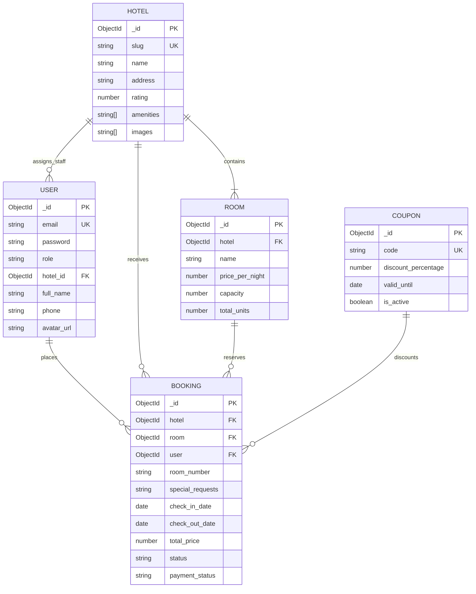

# PARADISE Palace Hotels Database & Server Schemas (`server.md`)

## 1. MongoDB Database Design

The database uses MongoDB with Mongoose ODM to model the hospitality domain. The database name is `hotel_mgmt` (accessible at `mongodb://127.0.0.1:27017/hotel_mgmt`).



---

## 2. Collection Schemas

### 2.1 `User` Collection (`models/User.js`)
```javascript
{
  email: { type: String, required: true, unique: true, lowercase: true, trim: true },
  password: { type: String, required: true },
  role: { 
    type: String, 
    enum: ['customer', 'hotel_manager', 'super_admin', 'staff'], 
    default: 'customer' 
  },
  hotel_id: { type: mongoose.Schema.Types.ObjectId, ref: 'Hotel', default: null }, // Assigned property for Manager & Staff
  full_name: { type: String, default: '' },
  phone: { type: String, default: '' },
  date_of_birth: { type: String, default: '' },
  address: { type: String, default: '' },
  avatar_url: { type: String, default: 'avatar-1' }, // Stores curated SVG persona avatar id
  createdAt: { type: Date, default: Date.now }
}
```

**Key Features**:
- Automatic `bcrypt` password hashing via pre-save hook (`userSchema.pre('save')`).
- `matchPassword(enteredPassword)` instance method for secure credential validation.

---

### 2.2 `Hotel` Collection (`models/Hotel.js`)
```javascript
{
  slug: { type: String, required: true, unique: true, lowercase: true },
  name: { type: String, required: true },
  description: { type: String, default: '' },
  address: { type: String, required: true },
  images: [{ type: String }],
  amenities: [{ type: String }],
  contact_email: { type: String, default: '' },
  contact_phone: { type: String, default: '' },
  rating: { type: Number, default: 4.8 },
  createdAt: { type: Date, default: Date.now }
}
```

---

### 2.3 `Room` Collection (`models/Room.js`)
```javascript
{
  hotel: { type: mongoose.Schema.Types.ObjectId, ref: 'Hotel', required: true },
  name: { type: String, required: true },
  description: { type: String, default: '' },
  price_per_night: { type: Number, required: true },
  capacity: { type: Number, default: 2 },
  images: [{ type: String }],
  amenities: [{ type: String }],
  total_units: { type: Number, default: 5 }, // Physical suite inventory capacity
  createdAt: { type: Date, default: Date.now }
}
```

---

### 2.4 `Booking` Collection (`models/Booking.js`)
```javascript
{
  hotel: { type: mongoose.Schema.Types.ObjectId, ref: 'Hotel', required: true },
  room: { type: mongoose.Schema.Types.ObjectId, ref: 'Room', required: true },
  user: { type: mongoose.Schema.Types.ObjectId, ref: 'User', default: null },
  room_number: { type: String, default: '' }, // Assigned physical room number (e.g. 101, 204)
  special_requests: { type: String, default: '' }, // Guest concierge requests (e.g. Late check-in, Extra bed)
  check_in_date: { type: String, required: true },
  check_out_date: { type: String, required: true },
  total_price: { type: Number, required: true },
  status: { 
    type: String, 
    enum: ['pending_payment', 'confirmed', 'checked_in', 'checked_out', 'cancelled'], 
    default: 'confirmed' 
  },
  guest_name: { type: String, required: true },
  guest_email: { type: String, required: true },
  guest_phone: { type: String, required: true },
  payment_status: { 
    type: String, 
    enum: ['pending', 'paid', 'refunded', 'failed'], 
    default: 'paid' 
  },
  coupon_code: { type: String, default: null },
  discount_applied: { type: Number, default: 0 },
  createdAt: { type: Date, default: Date.now }
}
```

---

### 2.5 `Coupon` Collection (`models/Coupon.js`)
```javascript
{
  code: { type: String, required: true, unique: true, uppercase: true, trim: true },
  discount_percentage: { type: Number, required: true, min: 1, max: 100 },
  discount_percent: { type: Number, min: 1, max: 100 }, // Normalized alias
  valid_until: { type: Date, default: null },
  is_active: { type: Boolean, default: true },
  createdAt: { type: Date, default: Date.now }
}
```

---

## 3. MongoDB Optimization & Indices

1. **Unique Email Index**: `{ email: 1 }` on `User` enforces distinct accounts at the database engine level.
2. **Unique Slug Index**: `{ slug: 1 }` on `Hotel` enables sub-millisecond lookup during slug-based page loads (`/hotels/:slug`).
3. **Compound Booking Index**: `{ hotel: 1, room: 1, check_in_date: 1, check_out_date: 1 }` allows rapid room availability verification.
